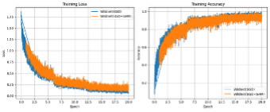
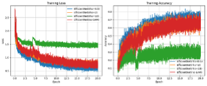
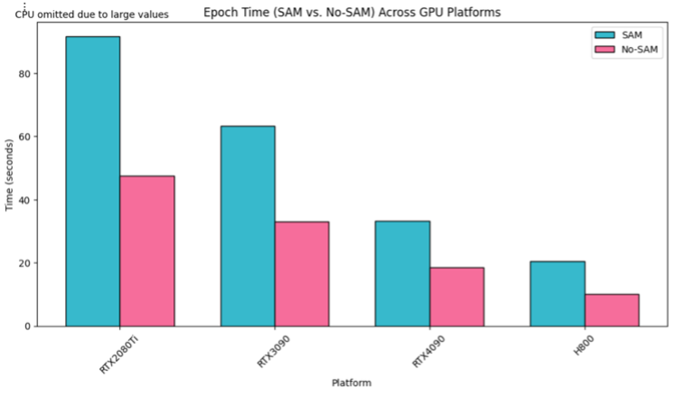
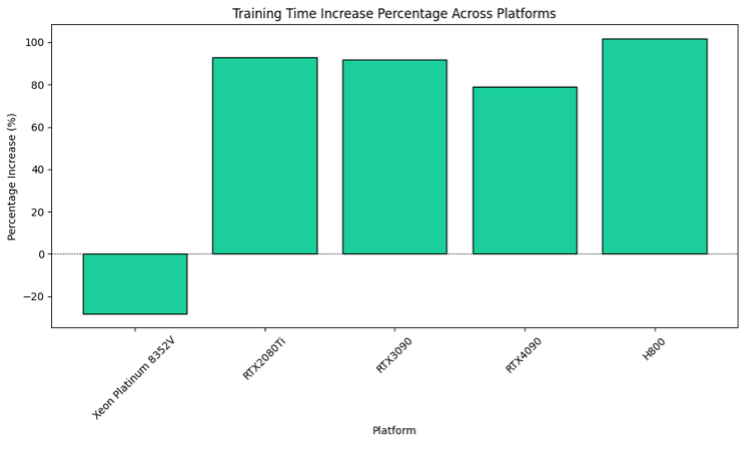

# SAM优化器与传统优化方法的对比实验

本项目在CIFAR-10数据集上对比了SAM（Sharpness-Aware Minimization）优化器与传统优化方法（SGD、Adam）在WideResNet和EfficientNet两种网络架构上的性能差异。

## 实验环境

- Python 3.x
- PyTorch
- CUDA支持（推荐使用GPU进行训练）

- 其他依赖包：
  - numpy
  - pandas
  - matplotlib
  - torchvision

## 数据集下载

本项目使用CIFAR-10数据集，代码会自动下载并处理数据集。数据集将被保存在`data`目录下。

## 运行方式

### 1. 安装依赖

```bash
pip install torch torchvision numpy pandas matplotlib
```

### 2. 训练模型

基本训练命令：
```bash
python train.py --model [MODEL_NAME] --optimizer [OPTIMIZER_NAME] --use_sam [True/False]
```

主要参数说明：
- `--model`: 选择模型架构，可选 "WideResNet" 或 "EfficientNet"
- `--optimizer`: 选择优化器，可选 "SGD" 或 "Adam"
- `--use_sam`: 是否使用SAM优化器
- `--rho`: SAM优化器的感知域半径参数（默认2.0）
- `--batch_size`: 批次大小（默认128）
- `--epochs`: 训练轮数（默认200）
- `--learning_rate`: 学习率（默认0.1）

示例命令：
```bash
# 使用SAM-SGD训练WideResNet
python train.py --model WideResNet --optimizer SGD --use_sam True --rho 0.5

# 使用普通SGD训练EfficientNet
python train.py --model EfficientNet --optimizer SGD --use_sam False
```

### 3. 查看训练结果

训练过程中的损失和准确率会被保存在CSV文件中（默认名称为`default.csv`）。可以使用`plot_training_curves.py`脚本绘制训练曲线：

```bash
python plot_training_curves.py --csv_file [CSV_FILE_NAME]
```

## 实验结果






### 1. 模型精度对比

在EfficientNet上使用SAM优化器（rho=0.5）相比普通SGD优化器：
- 精度提升：7.21%
- 训练时间增加：113.2%

在WideResNet上使用SAM优化器：
- 训练时间增加：79.01%

### 2. 不同硬件平台性能对比

在不同GPU平台上SAM优化器的训练时间相对增幅：
- RTX2080Ti (Turing): 92.76%
- RTX3090 (Ampere): 91.71%
- RTX4090 (Lovelace): 79.01%
- H800 (Hopper): 101.9%

### 3. 超参数影响

SAM优化器的rho参数对训练效果有显著影响：
- rho=0.5时获得最佳性能
- rho=10时可能导致训练精度异常波动

## 注意事项

1. SAM优化器会显著增加训练时间，建议使用GPU进行训练
2. 选择合适的rho参数对训练效果至关重要
3. 训练结果会保存在CSV文件中，可以用于后续分析
4. 代码支持混合精度训练，可以加快训练速度